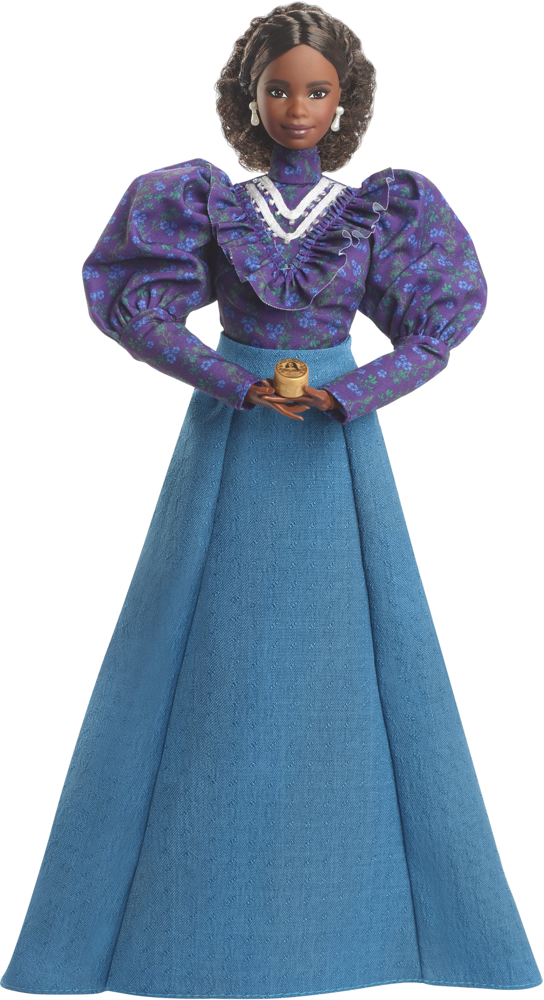

```{r setup, include=FALSE}
knitr::opts_chunk$set(echo = TRUE)
```

```{cat, engine.opts = list(file = "color-text.lua")}
Span = function(el)
  color = el.attributes['color']
  -- if no color attribute, return unchange
  if color == nil then return el end
  
  -- transform to <span style="color: red;"></span>
  if FORMAT:match 'html' then
    -- remove color attributes
    el.attributes['color'] = nil
    -- use style attribute instead
    el.attributes['style'] = 'color: ' .. color .. ';'
    -- return full span element
    return el
  elseif FORMAT:match 'latex' then
    -- remove color attributes
    el.attributes['color'] = nil
    -- encapsulate in latex code
    table.insert(
      el.content, 1,
      pandoc.RawInline('latex', '\\textcolor{'..color..'}{')
    )
    table.insert(
      el.content,
      pandoc.RawInline('latex', '}')
    )
    -- returns only span content
    return el.content
  else
    -- for other format return unchanged
    return el
  end
end
```

# [*A Real Inspiration*]{color="DeepPink"}

[***MATTEL DR. JANE GOODALL BARBIE***]{color="DeepPink"}

*BY JENNIFER DUGGAN*

*NOVEMBER 10, 2022 6:18 AM EST, TIME MAGAZINE*

Pioneering primatologist Jane Goodall is the latest subject of the Barbie Inspiring Women Series, which celebrates “courageous women who took risks.” The doll representing the renowned chimpanzee expert is made from a minimum of 75% recycled plastic. Launched in July, the carbon–neutral doll can be purchased with a figure of David Greybeard, the first chimpanzee Goodall worked with at Gombe National Park in Tanzania in 1960. “My entire career, I’ve wanted to help inspire kids to be curious and explore the world around them,” Goodall said upon the doll’s launch. Others in the series include Rosa Parks, Eleanor Roosevelt, Maya Angelou, and Florence Nightingale; Goodall is the first to be made with recycled materials.

https://time.com/collection/best-inventions-2022/6228870/mattel-dr-jane-goodall-barbie/

<center>
{width=50%}
</center>
--------------------------------------------------------------------------------

\newpage

# [***Look-Alikes***]{color="DeepPink"}

In search of a look-alike product for Mattel's Dr. Jane Goodall Barbie doll, it is impossible not to mention their  "Barbie Inspiring Women" collection, which brings not one but several look-alike products from the past.   Mattel's "Barbie Inspiring Women" collection celebrates and recreates the Barbie doll versions of remarkable women who contributed significantly to various fields, including Amelia Earhart (2010), Frida Kahlo (2018), Rosa Parks (2019), and Katherine Johnson (2018). 

The "Barbie Inspiring Women" series continues the tradition of creating educational and inspiring dolls with the release of the Dr. Jane Goodall Barbie doll. The doll accurately portrays the likeness of Dr. Jane Goodall, a renowned conservationist and primatologist. Together, these dolls serve as valuable resources for children to learn about exceptional women in history and find inspiration to impact the world positively.


<div style="display: flex; justify-content: center;">

{width=30%}

{width=30%}

{width=40%}

{width=30%}

{width=30%}

</div>


\newpage

# [***Time-Series***]{color="DeepPink"}

**Gross sales of Mattel's Barbie brand worldwide from 2012 to 2022**

For this assignment, using the yearly time series data on "Gross sales of Mattel's Barbie brand worldwide from 2012 to 2022" is a practical choice for several reasons. Firstly, it's important to acknowledge that finding open-source and verified datasets for specific look-alike products, especially those within the "Barbie Inspiring Women" collection or similar lines from other brands, can be a daunting task. These specific sales datasets are often not publicly available or readily accessible on open-source platforms. Nevertheless, after spending several hours searching for a dataset, I came to this conclusion.

Furthermore, using the "Gross sales of Mattel's Barbie brand worldwide" dataset offers a broader perspective that encloses the overall performance of the Barbie brand, including all its variations and collections over a decade. This dataset is sourced directly from Mattel's reports, providing a reliable and credible source of information. 

[***Time-Series Source From Statista (link)***](https://www.statista.com/statistics/370361/gross-sales-of-mattel-s-barbie-brand/)

--------------------------------------------------------------------------------

```{r echo=T, results='hide',include=FALSE}
libs<-c('ggplot2','ggpubr','knitr','diffusion','ggthemes', 'colorspace', 'minpack.lm')
load_libraries<-function(libs){
new_libs <- libs[!(libs %in% installed.packages()[,"Package"])]
if(length(new_libs)>0) {install.packages(new_libs)}
lapply(libs, library, character.only = TRUE)
}
load_libraries(libs)
```


```{r, fig.width=9, fig.height=7, fig.cap="Gross Sales of Mattel's Barbie Brand (2012-2022)", fig.align='center'}

# Define the values
sales_values <- c(
  1275.30, 1202.80, 1009.50, 905.90, 971.80,
  954.89, 1088.95, 1159.77, 1350.10, 1679.30, 1490.60)

# Create a time series object
sales_time_series <- ts(sales_values, start = 2012, end = 2022, frequency = 1)

# Plot the time series data
plot(sales_time_series, ylab = "Gross Slaes (in million U.S. dollars)", xlab = "Year",
     main = "Gross Sales of Mattel's Barbie Brand \n(2012-2022)", 
     col = 'hotpink', cex.main = 1.7)  
```
\clearpage
\newpage

```{r, fig.cap="Gross Sales of Mattel Barbie Brand (2012-2022), mln US$"}
# Create a data frame with year and sales data
sales_df <- data.frame(
  year = c(2012, 2013, 2014, 2015, 2016, 2017, 2018, 2019, 2020, 2021, 2022),
  sales = c(1275.30, 1202.80, 1009.50, 905.90, 971.80, 954.89, 1088.95,
            1159.77, 1350.10, 1679.30, 1490.60))

# Create a ggplot visualization for gross sales over the years
ggplot(data = sales_df, aes(x = factor(year), y = sales, fill = as.factor(sales))) +
  geom_bar(stat = 'identity') +  # Plot gross sales as bars
  # Set the title
  ggtitle('Gross Sales of Mattel Barbie Brand (2012-2022), mln US$') +  
  xlab("") +  # Set the x-axis label
  ylab("Sales") +  # Set the y-axis label
  # Apply the 'theme_gdocs' theme
  theme_gdocs() +
  # Customize the appearance of the plot
  theme( panel.grid.major = element_line(linetype = "dotted"),
         plot.title = element_text(size = 12, hjust = 0.5, face = "bold")) + 
  # Define custom color scale
  scale_fill_manual(values = rev(sequential_hcl(n = 11, h = 325, l = c(50, 80))))  +
  # Remove the legend for the 'fill' aesthetic
  guides(fill='none')

```


\newpage

# [***Modeling f(t)***]{color="DeepPink"}

```{r}
#Define function for f(t) 
bass.f <- function(t,p,q){
  ((p+q)^2/p)*exp(-(p+q)*t)/(1+(q/p)*exp(-(p+q)*t))^2}

# Create a ggplot visualization for the Bass model with specific parameters
time_ad = ggplot(data.frame(t = c(1:11)), aes(t)) +
  # Plot the Bass model with fixed parameters
  stat_function(fun = bass.f, args = c(p=0.002, q=0.21), color = 'hotpink') +  
  # Apply the 'theme_gdocs' theme
  theme_gdocs() +
  ylab("")+  # Remove the y-axis label
  #Set a title
  ggtitle('f(t)') +  
  # Customize the appearance of the plot
  theme( panel.grid.major = element_line(linetype = "dotted"),
         plot.title = element_text(size = 20, hjust = 0.5, face = "bold")) 
  
```

-------------------------------------------------------------------------------

# [***Visualizing f(t)***]{color="DeepPink"}


```{r, fig.width=13, fig.height=7, fig.cap="f(t) and Gross Sales of Mattel Barbie Brand (2012-2022), mln US$"}

# Create a ggplot visualization for gross sales data
bb_sales = ggplot(data = sales_df, aes(x = factor(year), y = sales, 
                                       fill = as.factor(sales))) +
  geom_bar(stat = 'identity') +  # Plot gross sales as bars
  # Apply the 'theme_gdocs' theme
  theme_gdocs() +
  # Set the x-axis and y-axis labels and title
  xlab("") + ylab("") +
  ggtitle('Gross Sales of Mattel Barbie Brand \n(2012-2022), mln US$') +  
  # Customize the appearance of the plot
  theme( panel.grid.major = element_line(linetype = "dotted"),
         plot.title = element_text(size = 20, hjust = 0.5, face = "bold")) + 
  # Define custom color scale
  scale_fill_manual(values = rev(sequential_hcl(n = 11, h = 325, l = c(50, 80))))  +
  # Remove the legend for the 'fill' aesthetic
  guides(fill='none')+
  # Specify x-axis breaks
  scale_x_discrete(breaks = unique(sales_df$year)[c(1, 6, 11)])  

# Arrange the two plots side by side
ggarrange(time_ad, bb_sales)
```

\clearpage
\newpage

# [***Estimation of Bass Model Parameters***]{color="DeepPink"}

We can estimate m, p and q with different approaches.

Use **nls()** - Non-linear Least Squares

$$\color{DeepPink}{m\cdot\frac{\left(p+q\right)^{2}\cdot e^{-\left(p+q\right)t}}{p\left[1+\frac{q}{p}e^{-\left(p+q\right)t}\right]^{2}}}$$

Now this is a number of adopters rather than the probability of adoptions (multiplied by m).

[***Note:***]{color="DeepPink"}

[*The 'minpack.lm' package is utilized for this task, which includes a function named nlsLM(). This function works well and estimates the parameters p, q, and m; however, there is a problem. The function reaches the maximum iteration limit (50) and returns the parameter values that have been estimated at that point, indicating that it does not converge. The reason for this problem might be that our dataset does not originate from the brand's creation date, and its barplot does not look like it can be fitted with the commonly used left-skewed bell-shaped distribution f(t). However, as discussed, rough estimations are sufficient for this analysis, and this approach is acceptable.*]{color="HotPink"}

-------------------------------------------------------------------------------

```{r warning=FALSE}
# Define the sales data and time points
sales = sales_df$sales
t = 1:length(sales)

# Define a function for the Bass model
bass_model <- function(t, m, p, q) {
  return(m * (((p + q)^2/p) * exp(-(p + q) * t)) / 
           (1 + (q/p) * exp(-(p + q) * t))^2)}

# Use nlsLM from the 'minpack.lm' package, which may be more robust
fit <- nlsLM(sales ~ bass_model(t, m, p, q), 
             start = c(m = sum(sales), p = 0.2, q = 0.4))

# Extract the fitted parameters
fitted_params <- coef(fit)
print(fitted_params)

#Make numeric for simple use
fitted_params <- as.numeric(fitted_params)
fitted_params 
```

--------------------------------------------------------------------------------

\newpage

# [***With Estimated Parameters***]{color="DeepPink"}

```{r fig.align='center', fig.width=16, fig.height=10, fig.cap="f(t) and Gross Sales of Mattel Barbie Brand (2012-2022), mln US"}

# Create a time-based line plot using ggplot
time_ad1 = ggplot(data.frame(t = c(1:11)), aes(t)) +
  # Plot the Bass function
  stat_function(fun = bass.f, args = c(p=fitted_params[2], q=fitted_params[3]), 
                color = 'hotpink') +  
  # Apply the 'theme_gdocs' theme
  theme_gdocs() +
  ylab("")+  # Remove the y-axis label
  #Set a title
  ggtitle('f(t)') +  
  # Customize the appearance of the plot
  theme( panel.grid.major = element_line(linetype = "dotted"),
         plot.title = element_text(size = 20, hjust = 0.5, face = "bold")) 

# Arrange the two plots side by side
ggarrange(time_ad1, bb_sales)


```

--------------------------------------------------------------------------------

\newpage 

# [***Predicting Sales***]{color="DeepPink"}

Multiplying ***f(t)*** by ***m***.

--------------------------------------------------------------------------------

```{r ,fig.width=6, fig.height=3, fig.cap="f(t) and Gross Sales Predictions of Mattel Barbie Brand (2012-2022), mln US$" }
# Calculate predicted sales using the Bass model and fitted parameters
sales_df$pred_sales = 
  bass.f(1:11, p=fitted_params[2], q=fitted_params[3]) * fitted_params[1]

# Create a ggplot visualization to compare actual and predicted sales
ggplot(data = sales_df, aes(x = factor(year), y = sales, fill = as.factor(sales))) +
  geom_bar(stat = 'identity') +  # Plot actual sales as bars
  # Plot predicted sales as points
  geom_point(mapping = aes(x = factor(year), y = pred_sales), color = 'navy', size=1) + 
  # Apply the 'theme_gdocs' theme
  theme_gdocs() +
  # Set the x-axis and y-axis labels and title
  xlab("") + ylab('Sales') +
  ggtitle("Gross Sales Predictions of Mattel Barbie Brand \n(in million U.S. dollars)") + 
  # Customize the appearance of the plot
  theme( panel.grid.major = element_line(linetype = "dotted"),
         plot.title = element_text(size = 12, hjust = 0.5, face = "bold")) + 
  # Define custom color scale
  scale_fill_manual(values = rev(sequential_hcl(n = 11, h = 325, l = c(50, 80))))  +
  # Remove the legend for the 'fill' aesthetic
  guides(fill='none')

```

\clearpage
\newpage

# [***Fermi's Logic: Estimating Potential Market Share and Adopters by Period***]{color="DeepPink"}

To estimate the number of adopters by period using Fermi's logic, we leverage the fact that Mattel sells 58 million Barbie dolls annually, equating to approximately 100 dolls every minute, reaching customers in 150 countries globally.

Moreover, Barbie doll sales target young girls aged 3 – 12 years.

A typical girl receives her first Barbie at age 3 and accumulates a total of seven dolls during her childhood.

Following this logic, girls, on average, collect 7 dolls over 9 years, which translates to approximately 1.3 Barbies each year.

[***Sources:***]{color="DeepPink"}

* https://www.foxbusiness.com/lifestyle/barbie-by-numbers

* https://www.chapman.edu/students/health-and-safety/psychological-counseling/_files/eating-disorder-files/13-barbie-facts.pdf

# [***Research Strategy***]{color="DeepPink"}


[***1. Calculation of Total Items Sold in 11 Years (2012-2022):***]{color="HotPink"}

* Take the annual sales figure of 58 million Barbie dolls.

* Multiply this figure by 11 to get the total items sold in 11 years (2012-2022).


[***2. Summarizing Predicted Total Sales (2012-2022):***]{color="HotPink"}

* Summarize predicted sales values for each year from 2012 to 2022 to calculate the total predicted sales for the period.


[***3. Calculating Percentage of Annual Sales:***]{color="HotPink"}

* For each year (2012-2022), determine what percentage the sales figure represents concerning the total predicted sales for the period.

* Calculate this percentage using the formula: (Annual Sales / Total Predicted Sales).


[***4. Refining Annual Sales Figures:***]{color="HotPink"}

* Multiply the total items sold in 11 years (step 1) by the percentage of total sales for each year (step 3).

* This will yield a more precise number of units sold for each year.


[***5. Estimating the Number of Adopters:***]{color="HotPink"}

* Divide the refined annual sales figures (step 4) by approximately 1.3, considering the average number of Barbies collected by a girl each year.

* This calculation estimates the number of adopters during each year within the 11-year period.

--------------------------------------------------------------------------------

```{r}
# Predictions of the diffusion of the innovation
predictions <- sales_df$pred_sales

# Calculate the average number of dolls sold per year (in millions)
average_dolls_per_year <- 58

# Calculate the estimated total number of items sold from 2012-2022
items_sold_total = length(sales_df$year)*average_dolls_per_year

#Calculate the predicted total sales from 2012-2022
pred_sales_total = sum(sales_df$pred_sales)

# Calculate the weight of each of the predicted sales values
sales_df$pred_sales_percentage <- (sales_df$pred_sales / pred_sales_total) 

# Calculate the precise estimation of annual units sold
sales_df$estimated_units_sold <- ((sales_df$pred_sales_percentage) * items_sold_total)

# Estimate the number of adopters (girls) per year
sales_df$estimated_adopters <- as.integer(sales_df$estimated_units_sold / (9/7))
```

```{r, fig.align='center', fig.cap= "Estimation of the Number of Adopters by Period"}

# Create a ggplot visualization for cumulative adopters
ggplot(data = sales_df, aes(x = factor(year), y = estimated_adopters, 
                            fill = as.factor(estimated_adopters))) +
  geom_bar(stat = 'identity') +  # Plot cumulative adopters as bars
  scale_y_continuous(breaks = NULL) +  # Remove breaks on the y-axis
  # Add text labels to the bars
  geom_text(aes(label = estimated_adopters), vjust = -0.5, size = 4) +
  xlab("") +  # Set the x-axis label
  ylab("Adopters") +  # Set the y-axis label
  #Set a title
  ggtitle("Estimation of the Number of Adopters by Period") + 
  # Apply the 'theme_gdocs' theme
  theme_gdocs() +
  # Customize the appearance of the plot
  theme( panel.grid.major = element_line(linetype = "dotted"),
         plot.title = element_text(size = 12, hjust = 0.5, face = "bold")) + 
  # Define custom color scale
  scale_fill_manual(values = rev(sequential_hcl(n = 11, h = 325, l = c(50, 80))))  +
  # Remove the legend for the 'fill' aesthetic
  guides(fill='none')
```

